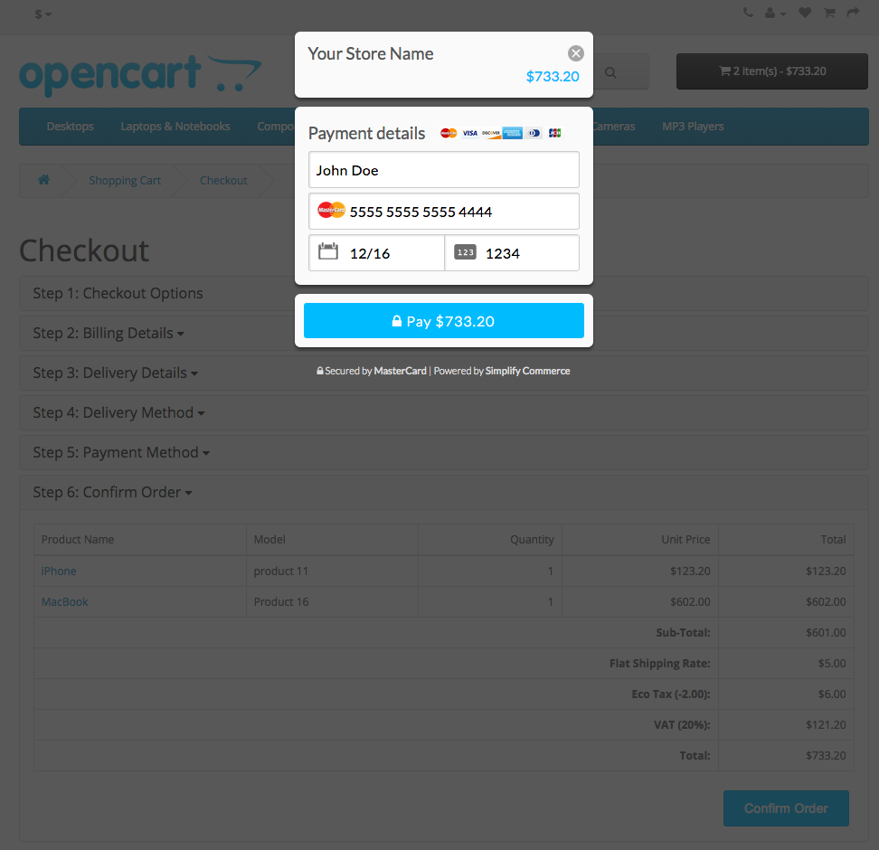

# Simplify Commerce payment module for OpenCart

This plugin adds Simplify Commerce as a payment option on your OpenCart checkout page.

Please note: The Standard payment form in some of the previous releases is now deprecated and out of support.

## Compatibility
Versions v1.0.0 to v1.0.4
- Compatible with OpenCart versions up to 1.5.6.4.

Versions v1.0.5 
- Compatible with OpenCart 2.0 (tested with v2.0.1.1)

Version v1.1.0
- Adds Hosted Payments mode.

Version v1.2.0
- Compatible with OpenCart 2.3.0.2

Version v1.2.1
- Enhancements and compatible with OpenCart 2.3.0.2

Version v2.0.0
- Compatiblity with OpenCart 3.0.3.1
- Removed standard (form) integration

## Installation
1. Make a backup of your site before applying new mods etc. 
2. [Download latest release](https://github.com/simplifycom/simplify-opencart-module/releases/latest)
3. Install the package by going to Extension > Installer and uploading the .ocmod.zip file

## Configuration
Login to your the OpenCart administration application

1. Go to Extension > Extensions
2. From the extension type filter, choose Payments
3. Scroll down until you find 'Simplify Commerce' extension, click on Edit button
4. Enter your public and private API keys into the appropriate fields for the live and sandbox mode. For information on your API keys go to https://www.simplify.com/commerce/docs/misc/index. NOTE: When using Hosted Payments, you must create and use an API key pair which has Hosted Payments enabled. 
5. Enter a Payment Title. This will be the name shown to your users on the checkout form.
6. Map the Successful and Declined status to suit your own workflow. This does not affect the Simplify Commerce configuration.
7. If you use multiple Payment Providers you can use Sort Order to configure how they're shown on the checkout form.
8. Don't forget to Enable the extension to activate it.

## Hosted Payments Mode
Customer will be presented with a button to confirm the order which when clicked will launch a secure form where the customer can input their card details.

If your website has an SSL certificate with HTTPS enabled, then the form will be overlayed on top of the existing webpage. Otherwise user will be taken to a secured page in a new window. When the customer completes the payment, he will be taken back to the success page.

