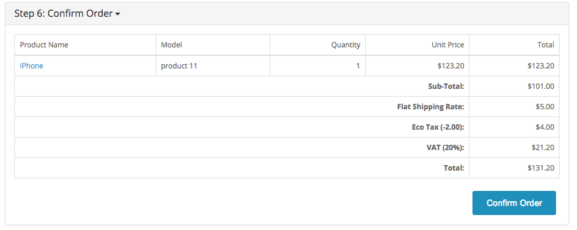
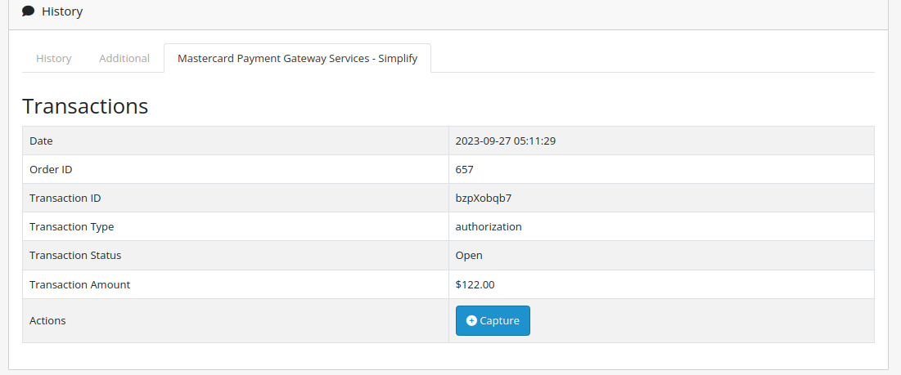
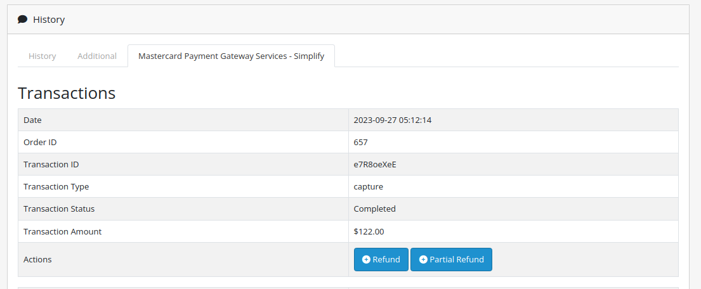

# Simplify Commerce payment module for OpenCart

This plugin adds Simplify Commerce as a payment option on your OpenCart checkout page.

Please note: The Standard payment form in some of the previous releases is now deprecated and out of support.

## System Requirments

The latest release of the plugin has the following system requirements:

- PHP version 8.0 or higher is mandatory.
- OpenCart version 4.0.2.3 or later is required. However, we strongly recommend using the latest available version of OpenCart for optimal performance.

## Documentation

Click here to access the documentation: https://mpgs.fingent.wiki/simplify-commerce/simplify-commerce-payment-gateway-for-opencart/compatibility/

## Support

For customer support:https://mpgsfgs.atlassian.net/servicedesk/customer/portals

## Compatibility
Versions v1.0.0 to v1.0.4
- Compatible with OpenCart versions up to 1.5.6.4.

Versions v1.0.5
- Compatible with OpenCart 2.0 (tested with v2.0.1.1).

Version v1.1.0
- Adds Hosted Payments mode.

Version v1.2.0
- Compatible with OpenCart 2.3.0.2.

Version v1.2.1
- Enhancements and compatible with OpenCart 2.3.0.2.

Version v2.0.0
- Compatibility with OpenCart 3.0.3.1.
- Removed standard (form) integration.

Version v2.1.0
- Adds Authorize + Capture transaction modes.

Version v2.2.0
- Added embedded option on checkout.
- Changed branding and some terminology.

Version v2.3.0
- Updated a way of adding necessary Styles and Scripts to the Checkout Page.

Version v2.4.0
- Rename Integration Model Field and Value Names on the extension Configuration page.

Version v2.5.0
- Enhanced Compatibility: Compatible with PHP 8.1 & Opencart 4.0.2.x (tested with v4.0.2.3).
- Updated SDK Version to 1.7.0.
- Added Refund Option.
- Added Partial Refund Option.

## Installation
1. Make a backup of your site before applying new mods etc.
2. Download .ocmod.zip file of the latest release of the extension from https://github.com/simplifycom/simplify-opencart-module/releases/latest
3. Go to Admin → Extensions → Installer and upload the downloaded .ocmod.zip file.
4. After uploading the OpenCart Module, you'll find it in the 'Installed Extensions' list. Simply use the '+' button to install the module.
5. Navigate to the "Payments" section by going to Admin → Extensions and choosing "Payments" from the extension type dropdown.
6. Search for the extension labeled "Mastercard Payment Gateway Services - Simplify" in the list and activate the module installation by clicking the plus symbol.

## Configuration
Please proceed with the following actions to configure the payment method:

1. Log in to your OpenCart administration application.
2. Go to Extension > Extensions
3. From the extension type filter, choose Payments
4. Scroll down until you find the 'Simplify Commerce' extension, and click on the Edit button
5. Enter your public and private API keys into the appropriate fields for the live and sandbox mode. For information on your API keys go to https://www.simplify.com/commerce/docs/misc/index. NOTE:When working with Hosted Payments, you'll need to establish and activate an API key pair designed for Hosted Payments.
6. Enter a Payment Title. This will be the name shown to your users on the checkout form.
7. Choose between Modal and Embedded Hosted Payment Method.  
8. Map the Successful and Declined status to suit your workflow. This does not affect the Simplify Commerce configuration.
9. If you use multiple Payment Providers you can use Sort Order to configure how they're shown on the checkout form.
10. Don't forget to Enable the extension to activate it.

## Hosted Payments

### Modal Payment Form

Clicking the 'Confirm Order' button triggers the secure payment form, where customers can safely enter their card information.

With an SSL certificate and HTTPS enabled, the form will overlay the current webpage; otherwise, users will directed to a secure page in a new window. Once the customer finishes the payment, they will seamlessly brought back to the success page.

### Embedded Payment Form

A secure payment form will be presented right on the checkout page. The customer can input their card details into that form and submit it to place an order.

### Capture Transaction

To capture the order, go to the History section on the order details page and click the "Capture" button provided.

### Refund / Partial Refund Transactions

When the order has been captured successfully, the "Refund" and "Partial Refund" buttons will be visible to the admin on the order details page.

