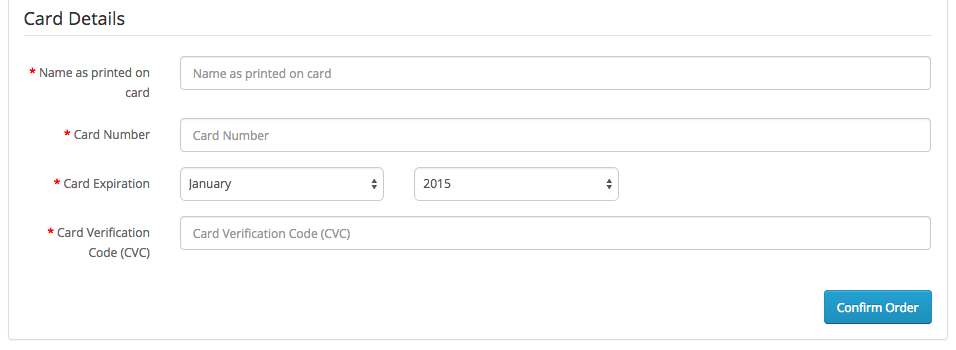

# Simplify Commerce payment module for OpenCart

This plugin adds Simplify Commerce as a payment option on your OpenCart checkout page.

## Installation
1. Make a backup of your site before applying new mods etc. 
2. 
3. Upload the contents of the 'upload' folder to the root directory of your OpenCart installation. These are new files and no files should be overwritten.  Windows will merge folders of the same name.  For Mac you can use this command line command: cp -R -v
4. Enable the extension by going to "Extensions > Payments > Simplify Commerce click "Install" and then "Edit". Enter all the mandetory fields. Click Save.

## Configuration

Login to your the OpenCart administration application. From the menu select; Extensions -> Payments

1. From the list of Payment extensions click the 'install' link next to Simplify Commerce and then click the 'edit' link. You will be presented with the Simplify Commerce setup screen.
2. Select whether you want to use live mode or test payments using the sandbox.
3. Enter your public and private API keys into the appropriate fields for the live and sandbox mode. For information on your API keys go to https://www.simplify.com/commerce/docs/misc/index.
4. Enter a Payment Title. This will be the name shown to your users on the checkout form.
5. Map the Successful and Declined status to suit your own workflow. This does not affect the Simplify Commerce configuration.
6. If you use multiple Payment Providers you can use Sort Order to configure how they're shown on the checkout form.
7. Don't forget to Enable the extension to activate it.

## Checkout Form

During checkout the Simplify Commerce option will be listed using the Payment Title you gave it during setup.

1. Fill out the details and click on the Pay with this Card button to complete the payment.
2. No credit card details are sent to your OpenCart site